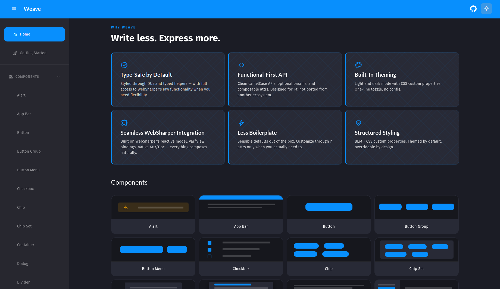
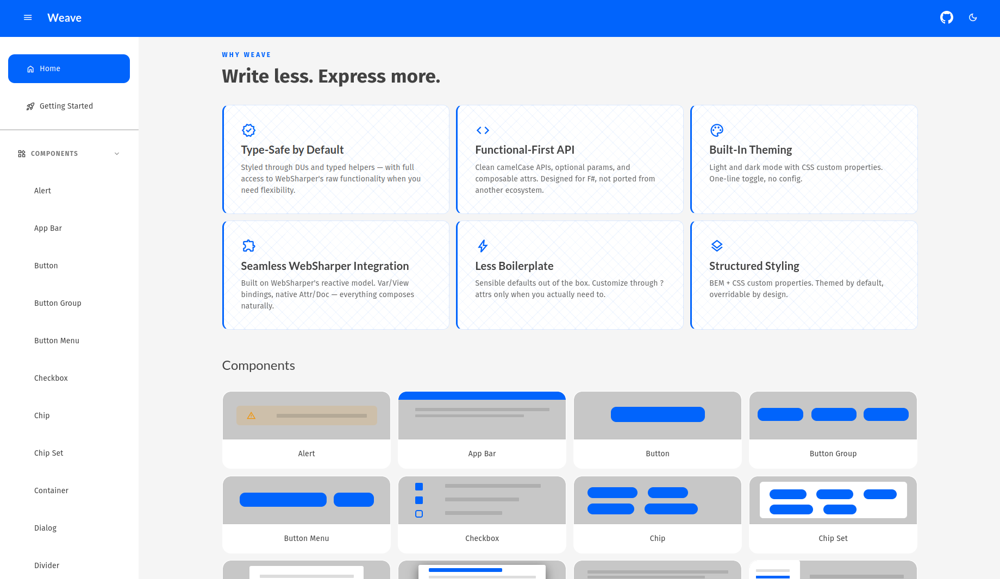

# Weave

<div align="center">
    
</div>
<div align="center">
    <i>Threading Logic. Fabricating UI.</i>
</div>
<br/>

[Weave](https://1eyewonder.github.io/Weave) is a modern component library for building web applications in F# with [WebSharper](https://websharper.com/). It provides a growing set of reusable UI components, layout primitives, and styling utilities designed to reduce boilerplate and improve developer experience.

Weave is opinionated where it matters — consistent theming, ergonomic APIs, and structured styling — while remaining flexible enough to work seamlessly with native WebSharper constructs.

⚠️ Weave is currently in active development and serves as an experimental playground. No packages exist as of yet.

## Vision

WebSharper provides a powerful foundation for full-stack F# web development, but it lacks a cohesive, modern component ecosystem comparable to what exists in other frameworks.

Weave aims to fill that gap by providing:

- A consistent, composable component model
- Built-in theming support
- Strong typing for styling and variants
- Familiar patterns inspired by mature ecosystems
- An API designed specifically for F# developers

The long-term goal is to create a production-ready component library that feels natural in F#, not a direct port of patterns from other ecosystems.

## Why Weave?

While working in WebSharper, I found myself missing the ergonomics and completeness of component libraries available in other frameworks such as:

- Clean component APIs
- Minimal boiler plate
- Rich theming support
- Strong developer experience

Weave draws inspiration from these principles, but reimagines them for:

- F#
- Functional-first thinking
- WebSharper’s architecture
- A more type-driven styling approach

This is not a clone — it is a reinterpretation with an F# mindset.

## Component Design Philosophy

### Functional Language, Practical API

F# encourages partial application and functional composition. However, UI components often require many optional parameters (events, styles, variants, configuration options).

To avoid excessive function overloads and deeply nested parameter patterns, Weave components are currently implemented using classes with optional parameters.

```fsharp
Button.create(
    text "Hello World!",
    onClick = (fun () -> ())
)
```

This approach provides:

- Clear discoverability via IntelliSense
- Predictable component construction
- A manageable API surface
- Extensibility as components grow in complexity

Future iterations may explore Computation Expressions (CEs) to provide a more idiomatic F# feel without sacrificing usability.

### Strongly-Typed Styling

Styling in Weave is designed to be:

- Discoverable
- Constrained
- Composable
- Type-safe where practical

Rather than relying solely on raw strings for CSS classes, Weave provides discriminated unions and helpers that map directly to supported styling variants.

```fsharp
Button.create(
    text "Hello World!",
    onClick = (fun () -> ()),
    attrs = [
        Button.Variant.outlined
        Button.Color.primary
    ]
)
```

This approach:

- Improves IntelliSense discoverability
- Reduces invalid style combinations
- Makes supported variants explicit
- Keeps styling aligned with component intent

Developers still retain full access to WebSharper’s native styling tools (Attr.Style, raw classes, etc.) when complete flexibility is required.

## Theming System

Weave includes built-in support for application theming.

Current features:

- Light theme
- Dark theme
- Runtime theme configuration
- Centralized theme definition

Theming configuration is defined in Theming.fs, allowing applications to override colors, spacing, and other design tokens.

### Dark Theme



### Light Theme



Current Status

Weave is:

- ✅ Functional
- ⚠️ Experimental
- 🚧 Evolving

It is currently a playground for exploring:

- F#-friendly component patterns
- Strongly typed styling abstractions
- Practical theming in WebSharper
- API ergonomics in a functional-first ecosystem

❗ Breaking changes are expected as design patterns mature.

## Getting Started

### Development Setup

1. Open `weave.code-workspace`
2. Install the recommended extensions
3. Run:
    ```bash
    ./build.cmd init
    ```
    or
    ```bash
    ./build.sh init
    ```

4. Start the documentation site:

```bash
dotnet run --project .\src\Weave.Docs\Weave.Docs.fsproj
```

5. Navigate to `http://localhost:5000` to view the documentation and examples.

## Testing

### Without Docker

**Dependencies:** .NET 10 SDK, Node.js 22+

Linux/macOS:

```bash
./build.sh RunTests
```

Windows:

```cmd
./build.cmd RunTests
```

### With Docker

**Dependencies:** Docker

```bash
docker compose build
docker compose run --rm playwright-tests
```

The Docker path runs Playwright rendering tests in a pre-configured browser environment. Use this if you don't have .NET 10 or Node.js 22 installed locally, or to match CI behavior exactly.

## Contributing

Community interest will shape the future of Weave.

You can:

- Open issues
- Submit pull requests
- Share design ideas
- Discuss on the F# Discord

Even early feedback is valuable at this stage.
