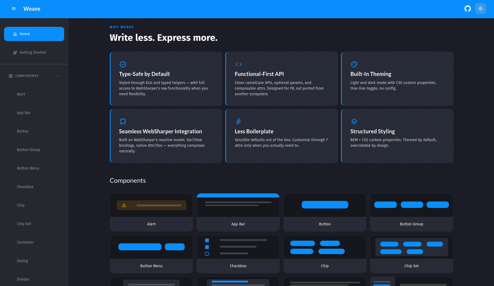
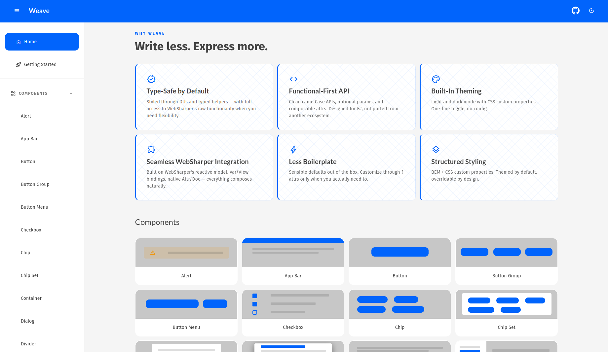

# Weave


<div align="center">
    
</div>
<div align="center">
    <i>Threading Logic. Fabricating UI.</i>
</div>

## Overview

Weave is a component library built around [WebSharper](https://websharper.com/) for building web applications in F#. It provides a set of UI components and utilities to streamline the development process, allowing developers to focus on application logic rather than boilerplate code.

⚠️ This project is under active development and just a playground for now. When it becomes more established, I can look into making proper releases and documentation.

### Why Weave?

When working in WebSharper, I have really missed having a component library similar to what I worked in the past with Blazor. [MudBlazor](https://mudblazor.com) was the one I was most familiar with and enjoyed using. A lot of the styling and component designs were inspired by MudBlazor, but reimagined for F# and WebSharper with some personal taste mixed in.

### Functional vs OOP

While partial application is one of my favorite features of F#, Weave components utilize classes in order to use optional parameters. Since UI components can quickly grow in complexity, this approach helps keep the codebase manageable while not creating an overwhelming number of functions for the end user.

```fsharp
Button.Create(
    text "Hello World!",
    onClick = (fun () -> ())
)
```

📓As I continue to play around with this library, I may try to add CEs to keep the API more "F-fsharpy"

### F# Meets CSS

I am a CSS novice, hence me using this as a playground for my learning. In order to simplify styling, Weave has a multitude of wrappers around CSS in order have intellisense help me with discoverability for styling options. Nothing stops the user from using WebSharpers 'Attr.Style' and other helpers though.

```fsharp
Button.Create(
    text "Hello World!",
    onClick = (fun () -> ()),
    attrs = [
        // cls: converts strings into WebSharper class attributes
        cls [ 
            // various DU based helpers to convert to CSS 
            // classes based on what different components support
            Button.Variant.toClass Button.Variant.Outlined
            Button.Color.toClass BrandColor.Primary
        ]
        
    ]
)
```

### Theming

Weave is looking to have built in support for theming applications. Currently, there is support for light and dark themes. There is also the ability to configure the theme at [runtime](./src/Weave/Theming.fs)




## Starting Development

1. Download .NET 10 SDK
    - https://dotnet.microsoft.com/en-us/download
2. Download VSCode
    - https://code.visualstudio.com/
3. Open `weave.code-workspace` file and press the `Open workspace` in the bottom right corner. Install the recommended extensions.
4. In your command line run:
    - `dotnet tool restore`
    - `dotnet paket restore`
    - `dotnet run --project .\src\Weave.Docs\Weave.Docs.fsproj`
5. Open your browser and navigate to `http://localhost:5000`

## Contributing

I'm unsure of the people's interest in this project, but feel free to reach out to me on the F# discord or open issues/PRs here on GitHub if you have suggestions or want to contribute!